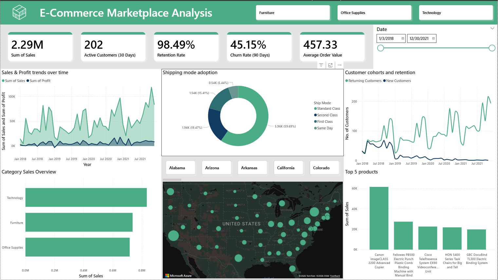
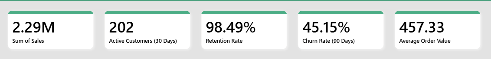
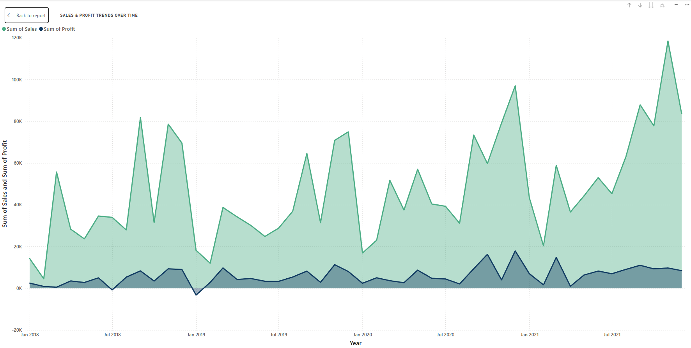
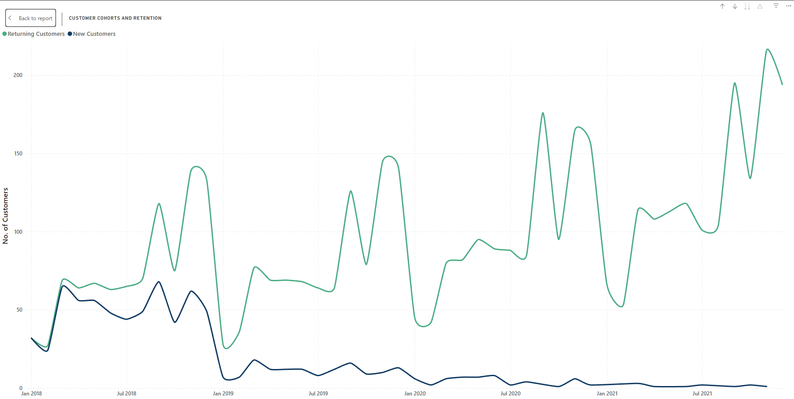
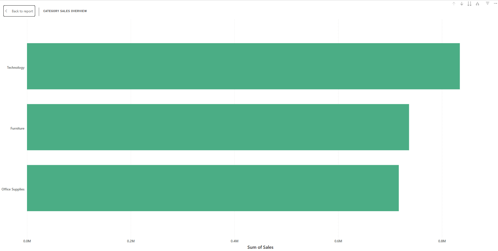
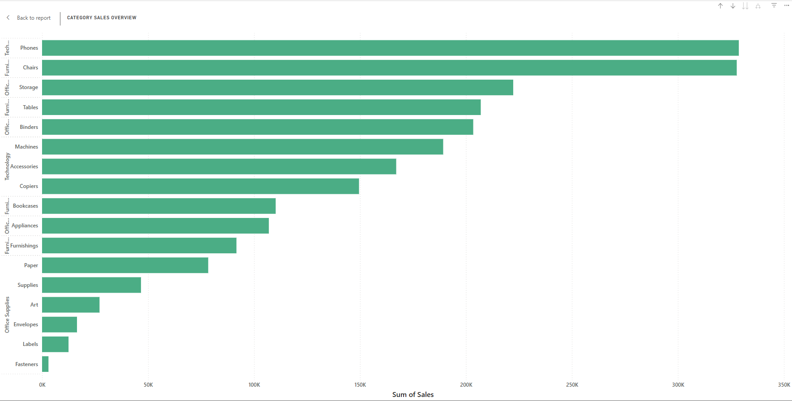
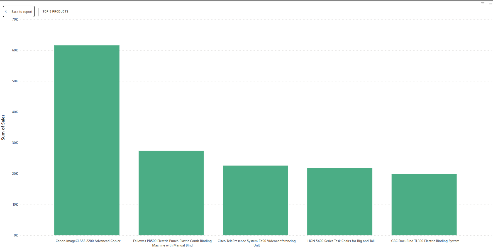
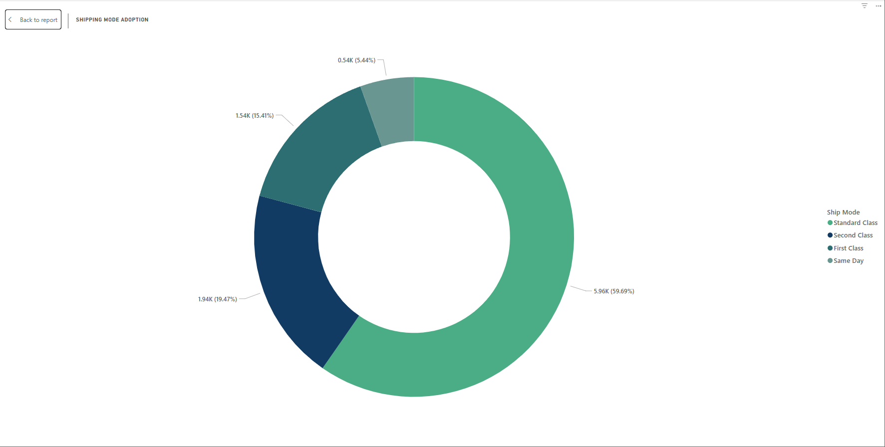
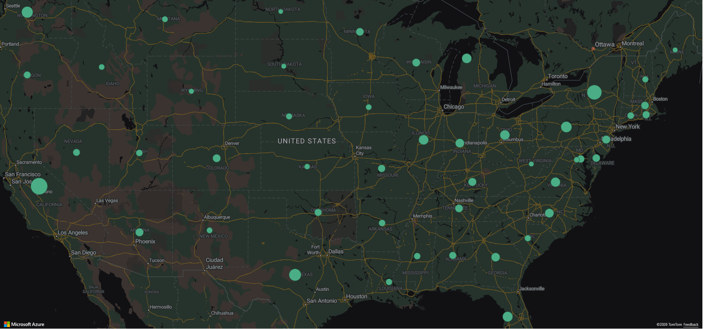

# E-Commerce Marketplace Analysis: Rawmart Performance Assessment

## Project Overview
This project is a technical assessment focused on analyzing a multi-year sales dataset for an online marketplace. The objective was to evaluate marketplace health by calculating core retail KPIs, identifying customer behavior patterns, and providing data-driven recommendations to improve profitability and customer lifetime value (LTV).

## Key Objectives
* *Data Cleaning & Validation:* Addressing missing values and inconsistent entries to ensure analytical integrity.
* *Feature Engineering:* Creating behavioral flags such as Active, Repeat, New, and Churned customers.
* *KPI Development:* Quantifying business performance through metrics like Average Order Value (AOV), Retention Rate, and LTV.
* *Segmentation:* Analyzing customer frequency and monetary value to identify high-value segments.

## The Dataset
The analysis was performed on a sales dataset containing approximately 9,994 records across 21 columns, including:
* *Order Details:* Order ID, Order Date, Ship Mode, and Sales.
* *Customer Information:* Customer ID, Name, Segment, and Geographic location.
* *Product Metrics:* Category, Sub-Category, Product Name, Quantity, and Profit.

## Methodology & Tools
* *Language:* Python 3.10.
* *Libraries:* pandas for data manipulation and datetime for time-series logic.
* *Data Cleaning:* * Converted Order Date and Ship Date to datetime objects for accurate period calculations.
    * Handled missing Postal Code values by removing affected rows (11 records).
    * Standardized geographic focus by filtering for "United States".
    * Removed invalid/test entries (e.g., Row ID 1 with placeholder data) to ensure data consistency.

## Business Insights & KPIs
Based on the Python analysis, the following baseline metrics were established:

| Metric | Value |
| :--- | :--- |
| *Average Order Value (AOV)* | $457.33 |
| *Customer Lifetime Value (LTV)* | $2,885.26 |
| *Retention Rate* | 98.49% |
| *Active Customers (Last 30 Days)* | 202 |
| *30-Day Churn Rate* | 73.93% |

Values derived from calculations in RawMart_DataPreperation.ipynb.

### Top Performing Categories (by Sales)
1.  *Technology:* Leading category with $834,554.27 in sales.
2.  *Furniture:* Strong performer at $736,617.74.
3.  *Office Supplies:* Stable contributor at $716,837.52.

## Dashboard Visualization

>Figure 1: RawMart E-Commerce Marketplace Analysis Dashboard

>Figure 2: Key Performance Indicator

> Figure 3: Sales & Profit trends over time highlighting performance peaks.

> Figure 4: Customer cohorts and retention curves.

> Figure 5&6: Performance breakdown by Category and Sub-Category.

> Figure 7: Top 5 Products based on sales.

> Figure 8: Shipping mode adoption.

> Figure 9: Map showing regional performance distribution.

## Key Recommendations
* *Re-engagement Strategy:* Address the high 30-day churn rate (73.93%) by implementing targeted re-engagement campaigns for customers who have not purchased in the last 60 days.
* *Product Promotion:* Focus marketing efforts on the "Technology" category and high-performing sub-categories like "Phones" and "Chairs".
* *Increase AOV:* Implement bundling or tiered discount strategies (e.g., Office Supplies add-ons) to drive the $457.33 Average Order Value further.
* *Regional Logistics:* Review shipping mode adoption in the "South" and "West" regions to enhance customer satisfaction while protecting profit margins.

---
*How to Run:* 1. Clone this repository.
2. Ensure the raw dataset is available as Sales.csv in the root directory.
3. Run the Jupyter Notebook RawMart_DataPreperation.ipynb to view the full data preparation and KPI calculation logic.